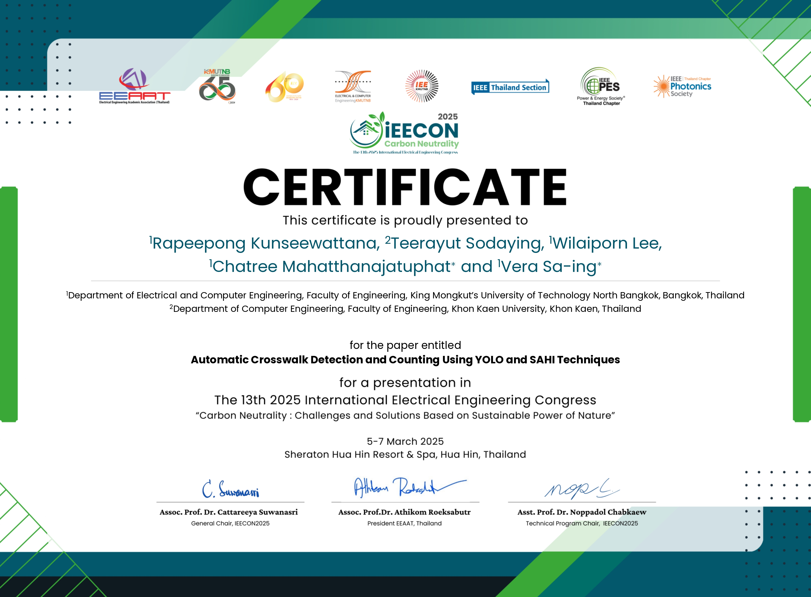
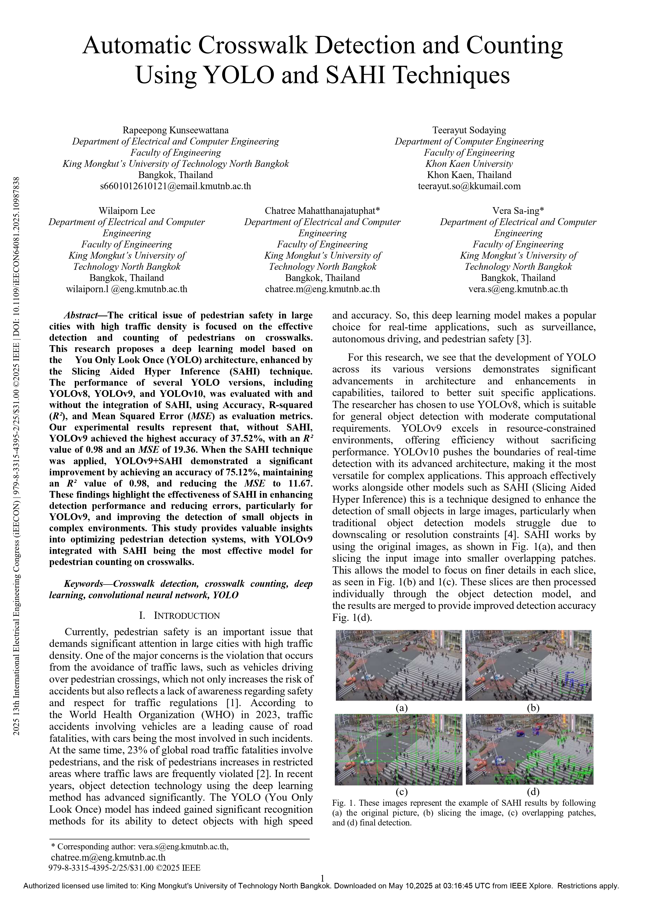
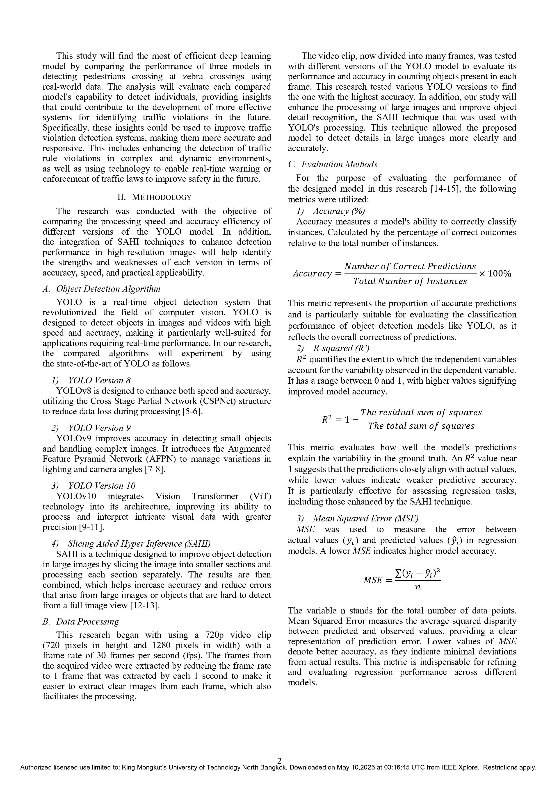
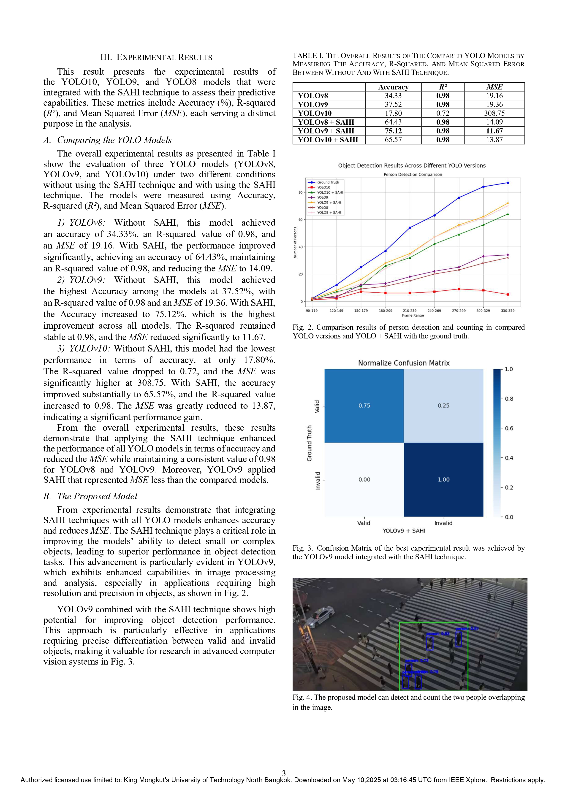
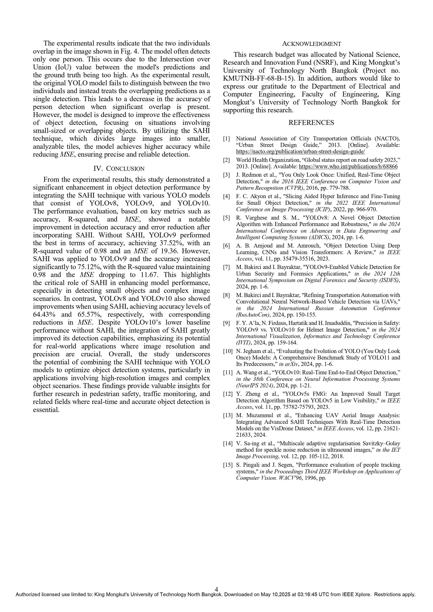

# **Overall my activities**

## **RESEARCH  PROJECT**
### **Automatic Crosswalk Detection using YOLO and SAHI Techniques**
>* Conducted a research project on automatic crosswalk detection using deep learning and object detection techniques.
>* Implemented and compared multiple versions of the YOLO model (YOLOv8, YOLOv9, YOLOv10) for enhanced detection accuracy.
>* Integrated the SAHI (Slicing Aided Hyper Inference) technique to improve detection on high-resolution images and boost model efficiency.
>* Achieved a detection accuracy of 75%, with the best performance using YOLOv9 + SAHI.
>* Developed and trained models entirely in Python, using a self-curated dataset of street-level imagery.
>* Successfully published and presented the research at the IEEE International Electrical Engineering Congress 2025.

  

  

## **PROJECTS**
### **Weighing Cup Lump Rubber using Three-Dimensional Scale**
>* Designed and developed for estimating the weight cup lump rubber using 3D imaging and computer vision.
>* Implemented the system using Python, OpenCV, and Intel RealSense depth cameras to generate 3D point clouds and extract volumetric data.
>* Aimed to improve the efficiency of agricultural product sorting and reduce human error.
>* Awarded Silver Medal in the national innovation competition “I-New Gen Award 2025”

  
  

### **Electronic Piano using VHDL and Custom Hardware**
>* Designed and implemented a digital electronic piano using VHDL on Intel MAX 10 and Cyclone IV FPGA development boards.
>* Used Intel Quartus Prime for VHDL synthesis, simulation, and board programming.
>* Converted musical notes into specific clock frequencies, each corresponding to a musical tone.
>* Programmed logic on FPGA and custom-built board to handle input keys and produce accurate pitch sound output.
>* Assembled and wired a custom hardware board with appropriate DAC/speaker output for real-time sound playback.

### **Digital Clock with Adjustable Time using State  Machines**
>* Developed a digital clock system implemented on an Intel MAX 10 FPGA, capable of displaying and adjusting time through Seven Segment Displays.
>* Implemented precise time counting using clock division and real-time logic in VHDL.
>* Designed the display logic to control multi-digit Seven Segment for hours and minutes.
>* Simulated, debugged, and synthesized the system using Intel Quartus Prime.