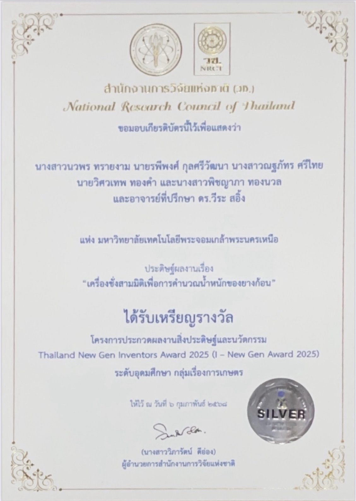
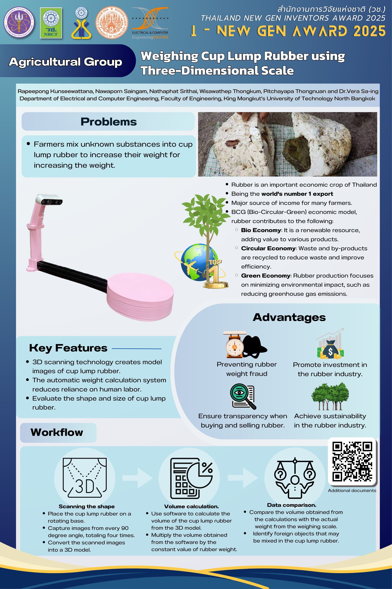

# **Overall my activities**

## **RESEARCH  PROJECT**
### **Automatic Crosswalk Detection using YOLO and SAHI Techniques**
> * Conducted a research project on automatic crosswalk detection using deep learning and object detection techniques.
> * Implemented and compared multiple versions of the YOLO model (YOLOv8, YOLOv9, YOLOv10) for enhanced detection accuracy.
> * Integrated the SAHI (Slicing Aided Hyper Inference) technique to improve detection on high-resolution images and boost model efficiency.
> * Achieved a detection accuracy of 75%, with the best performance using YOLOv9 + SAHI.
> * Developed and trained models entirely in Python, using a self-curated dataset of street-level imagery.
> * Successfully published and presented the research at the IEEE International Electrical Engineering Congress 2025.

<!-- 

 -->

## **PROJECTS**
### **Weighing Cup Lump Rubber using Three-Dimensional Scale**
>* Designed and developed for estimating the weight cup lump rubber using 3D imaging and computer vision.
>* Implemented the system using Python, OpenCV, and Intel RealSense depth cameras to generate 3D point clouds and extract volumetric data.
>* Aimed to improve the efficiency of agricultural product sorting and reduce human error.
>* Awarded Silver Medal in the national innovation competition “I-New Gen Award 2025”

 

